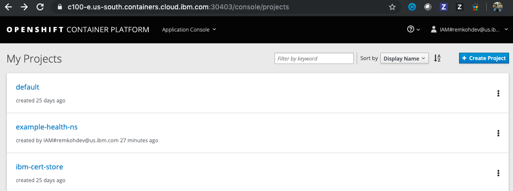
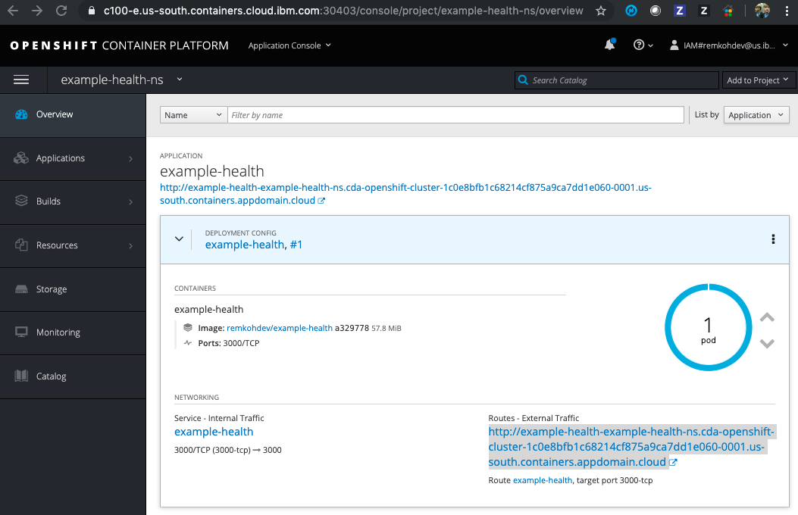

# Exercise 6: Deploying the Guestbook App from CLI

1. Get the source code for the Guestbook app

	* Clone the repo to your localhost,
		```console
		$ git clone https://github.com/IBM/node-s2i-openshift
		Cloning into 'node-s2i-openshift'...
		remote: Enumerating objects: 94, done.
		remote: Counting objects: 100% (94/94), done.
		remote: Compressing objects: 100% (82/82), done.
		remote: Total 509 (delta 27), reused 54 (delta 12), pack-reused 415
		Receiving objects: 100% (509/509), 7.27 MiB | 3.12 MiB/s, done.
		Resolving deltas: 100% (276/276), done.
		```
	
	* Run the `Health Example` app on your localhost to make sure it's running correctly,

		```console
		$ cd node-s2i-openshift
		$ cd site
		$ npm install
		$ npm start
		$ open http://localhost:8080/
		```

2. Run the Example Health app with Docker,

	* In the directory `./site` create a new file `Dockerfile`,

		```console
		$ touch Dockerfile
		```

	* Edit the `Dockerfile` and add the following commands,

		```text
		FROM node:10-slim

		USER node

		RUN mkdir -p /home/node/app
		WORKDIR /home/node/app

		COPY --chown=node package*.json ./
		RUN npm install
		COPY --chown=node . .

		ENV HOST=0.0.0.0 PORT=3000

		EXPOSE ${PORT}
		CMD [ "node", "app.js" ]
		```

	* Run the app with Docker,

		```console
		$ docker stop example-health
		$ docker rm example-health
		$ docker build --no-cache -t example-health .
		$ docker run -d --restart always --name example-health -p 3000:3000 example-health
		da106f3b5a06a00ea8bf56c54e29f6e38405a77c6dec3e461e3062aa823d8a4f
		```

3. Build and Push the Image to your public Docker Hub Registry.

	* Make sure to change the <username> by the username of your Docker Hub account,

	```bash
	$ docker build --no-cache -t example-health .
	Sending build context to Docker daemon  8.229MB
	Step 1/10 : FROM node:10-slim
	 ---> 8d33f30db9b5
	... and more
	Successfully built aaf90ce81dd7
	Successfully tagged example-health:latest

	$ docker tag example-health:latest <username>/example-health:1.0.0
	$ docker login -u <username>
	Password: 
	Login Succeeded
	
	$ docker push <username>/example-health:1.0.0
	The push refers to repository [docker.io/remkohdev/example-health]
	b33f2248b6f9: Pushed 
	195f723f9ebb: Pushed 
	0912774a40f4: Pushed 
	3558c6f90d27: Pushed 
	4d1d690b5181: Mounted from remkohdev/guestbook-api 
	bc272904b2c4: Mounted from remkohdev/guestbook-api 
	784c13bc7926: Mounted from remkohdev/guestbook-api 
	0e0d79e2c080: Mounted from remkohdev/guestbook-api 
	e9dc98463cd6: Mounted from remkohdev/guestbook-api 
	1.0.0: digest: sha256:a329778ce422e3d25ac9ff70b5131a9de26184a1e94b6d08844ea4f361519fd7 size: 2205
	```

3. Login to the Remote OpenShift Cluster

	* Login to the OpenShift cluster web console,
	* From the logged in user drop down in the top right of the web console, select `Copy Login Command`,
	* The login command will be copied to the clipboard,
	* In your terminal, paste the login command, e.g.

		```console
		$ oc login https://c100-e.us-south.containers.cloud.ibm.com:30403 --token=jWX7a04tRgpdhW_iofWuHqb_Ygp8fFsUkRjOK7_QyFQ
		```

4. Create a new Project

	* Create a new project `example-health-ns`,

		```console
		$ oc new-project example-health-ns
		Now using project "example-health-ns" on server "https://c100-e.us-south.containers.cloud.ibm.com:30403".

		You can add applications to this project with the 'new-app' command. For example, try:

			oc new-app centos/ruby-25-centos7~https://github.com/sclorg/ruby-ex.git

		to build a new example application in Ruby.
		```

	* Use the `example-health-ns` project,

		```console
		$ oc project example-health-ns
		Already on project "example-health-ns" on server "https://c100-e.us-south.containers.cloud.ibm.com:30403".
		$ oc project
		Using project "example-health-ns" on server "https://c100-e.us-south.containers.cloud.ibm.com:30403".
		```
   
5. Deploy the `Example Health` app using the Docker image,

	* Create the application, and replace <username> by the username of your Docker Hub account,
  	
		```console
		$ oc new-app <username>/example-health:1.0.0
		--> Found Docker image aaf90ce (8 minutes old) from Docker Hub for "<username>/example-health:1.0.0"

			* An image stream tag will be created as "example-health:1.0.0" that will track this image
			* This image will be deployed in deployment config "example-health"
			* Port 3000/tcp will be load balanced by service "example-health"
			* Other containers can access this service through the hostname "example-health"

		--> Creating resources ...
			imagestream.image.openshift.io "example-health" created
			deploymentconfig.apps.openshift.io "example-health" created
			service "example-health" created
		--> Success
			Application is not exposed. You can expose services to the outside world by executing one or more of the commands below:
			'oc expose svc/example-health' 
			Run 'oc status' to view your app.
		```

	* This will create an ImageStream, Deployment, a Pod, and a Service resource for the `Example-Health` app,

6. Expose the `Example-Health` service,

	* The last thing to do is to create a route. By default, services on OpenShift are not publically available. A route will expose the service publically to external traffic.

		```console
		$ oc expose svc/example-health
		route.route.openshift.io/example-health exposed
		```
	
	* View the status,

		```console
		$ oc status
		In project example-health-ns on server https://c100-e.us-south.containers.cloud.ibm.com:30403

		http://example-health-example-health-ns.cda-openshift-cluster-1c0e8bfb1c68214cf875a9ca7dd1e060-0001.us-south.containers.appdomain.cloud to pod port 3000-tcp (svc/example-health)
		dc/example-health deploys istag/example-health:1.0.0 
			deployment #1 deployed 5 minutes ago - 1 pod

		2 infos identified, use 'oc status --suggest' to see details.
		```

7.  Review the `Example-Health` app in the web console,

	* Go to `My Projects` via URI `/console/projects`,

		

	* Select the project `example-health-ns`, unfold the `DEPLOYMENT CONFIG` for `example-health` application details,

		

	* In the `NETWORKING` section, click the `Routes - External Traffic` link, e.g. http://example-health-example-health-ns.cda-openshift-cluster-1c0e8bfb1c68214cf875a9ca7dd1e060-0001.us-south.containers.appdomain.cloud

	* This opens the Example Health app in a new tab of your browser,
	* Login with `admin:test`,

		