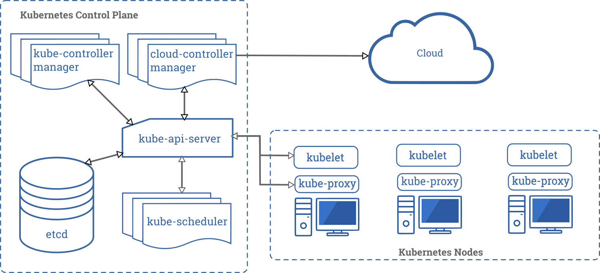

# Kubernetes Basics

A Kubernetes cluster consists of a set of worker machines, called nodes, that run containerized applications. The worker node(s) host the Pods that are the components of the application workload. The control plane manages the worker nodes and the Pods in the cluster. In production environments, the control plane usually runs across multiple computers and a cluster usually runs multiple nodes, providing fault-tolerance and high availability. The kube-api-server, or API Server in short, is the brain of the Kubernetes cluster. In this lab, we'll be executing various Kubernetes commands/operations by using the powerful **kubectl** CLI which will talk to the API Server. It is possible to access the API Server via REST calls or officially supported client libraries but **kubectl** CLI is the most common and preferred way. 



Reference: [Kubernetes Docs](https://kubernetes.io/docs/concepts/overview)

## Checking access to a Kubernetes cluster

```
kubectl version --short
```

If the above command returns the Kubernetes version, you're good to go. You're free to use any managed Kubernetes service or local Kubernetes installation for this lab. 

## Deploying a microservices app on Kubernetes 

The following command creates a [Kubernetes Deployment](https://kubernetes.io/docs/concepts/workloads/controllers/deployment/) called **dewans-app** from dewandemo/authors image (which is on Docker Hub).

```
kubectl create deployment dewans-app --image=index.docker.io/dewandemo/authors:v1
```

One of the powerful feature of Kubernetes is the ability to scale your deployment up or down. The following command scales up **dewans-app** deployment to three [repliacas](https://kubernetes.io/docs/concepts/workloads/controllers/replicaset/).

```
kubectl scale deployment dewans-app --replicas=3
```

Execute the following command to view the running pods:

```
kubectl get pods
```

If you don't have any previous pods running on your system, you should see three pods running.

## Self-healing of Kubernetes 

From the output of the last command you ran, you should see a list like below:

```
dewans-app-cf48574d-6cssh      1/1     Running   0          10m
dewans-app-cf48574d-c97hr      1/1     Running   0          9m4s
dewans-app-cf48574d-pqssh      1/1     Running   0          9m4s
```

Delete one of the pods:

```
kubectl delete pods dewans-app-cf48574d-6cssh
```

After few moments, execute the following command and you should still see three running pods.

```
kubectl get pods
```

Kubernetes deleted one of the pods but the deployment ensures a replica of three at all times so another pod was spun up.

## Updating the deployment with newer version of image

```
kubectl set image deployment/dewans-app authors=index.docker.io/dewandemo/authors:v2
```

This is how easily you can update a deployment to use a newer (or older) image.
